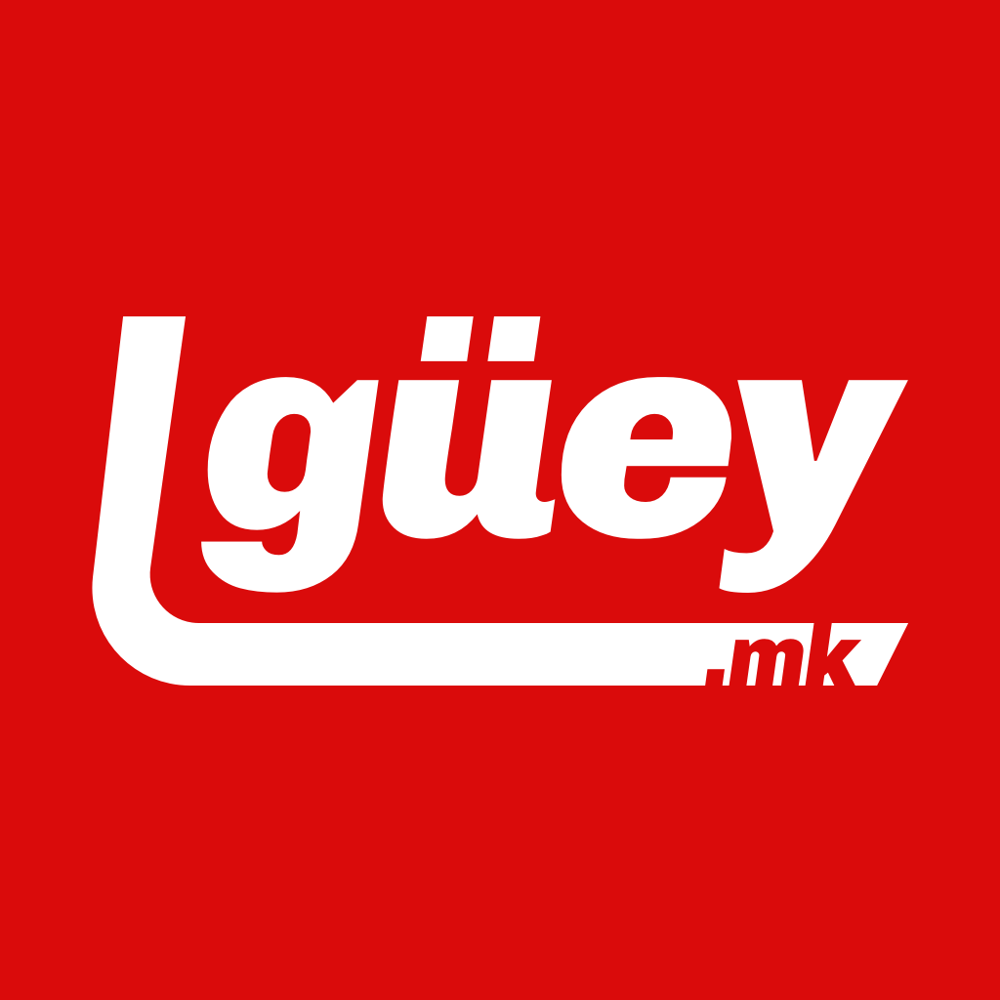

<h1 align="center">
   
   
    elguey.mk
</h1>

<h4 align="center">
  Elguey.mk is a blog that showcases my mechanical keyboard collection.
</h4>

  

## Background

After amassing lots of plastic and metal, I wanted a way to track my keyboard/keycap set inventory. Sure, I could have made a simple spreadsheet, but I also wanted to showcase my collection.

## What I use

- Gatsby
- Vercel (host)
- Prismic (CMS)
- React Hooks
- Emotion
- Emotion Theming + React Context
- React Spring
- Cypress
- Jest
- Testing library

## Installation

Unfortunately, my Prismic repo is private and a token is required so you cannot run this locally. However, you are free to explore this repo and hopefully there is something you can find valuable; if you have any questions or suggestions feel free to hit me up at yo@arturoalviar.com
